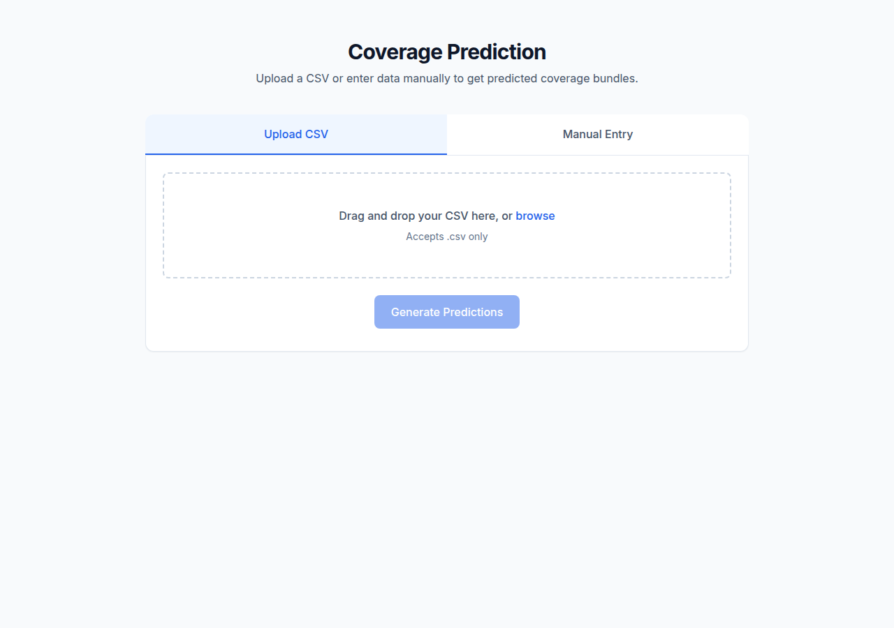
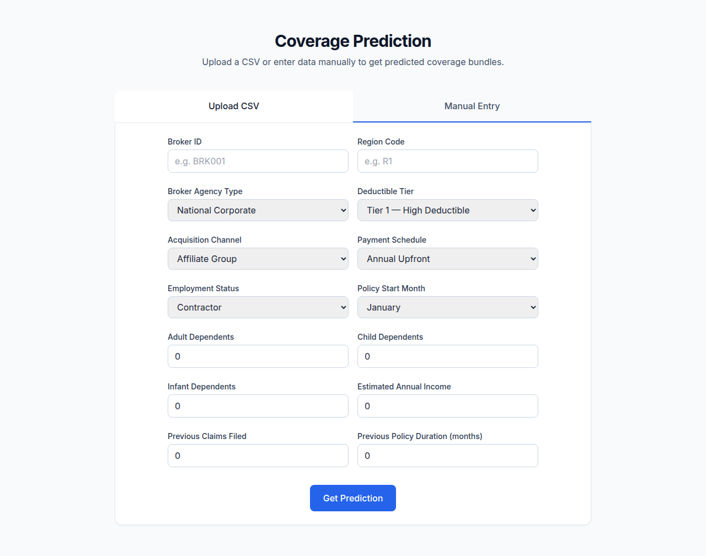

# DataQuest — Insurance Coverage Prediction


A full-stack web application that serves a trained ML model to predict insurance coverage bundles (0–9). Upload a CSV for batch predictions or enter a single record through the manual form.

## Screenshots

| CSV Upload Tab | Manual Entry Tab |
|---|---|
|  |  |

## Features

- **CSV batch prediction** — drag-and-drop upload, returns results table with bundle names
- **Manual single-record prediction** — form with all required fields, displays predicted bundle
- **Health check endpoint** — quick liveness probe at `/health`
- **Human-readable bundle names** — 0–9 mapped client-side (Basic Auto, Standard Auto Plus, …, Custom Enterprise)

## Tech Stack

| Layer | Technology |
|---|---|
| Backend | Python, FastAPI, Uvicorn |
| ML Pipeline | Pandas, Joblib, CatBoost |
| Frontend | Vanilla HTML + JavaScript, Tailwind CSS (CDN) |

## Quick Start

```bash
# Clone and enter the project directory
cd dataquest-webapp

# Create and activate a virtual environment
python3 -m venv venv
source venv/bin/activate

# Install dependencies
pip install -r requirements.txt

# Start the dev server
uvicorn main:app --reload --host 0.0.0.0 --port 8000
```

Open **http://127.0.0.1:8000/** in your browser.

> **Note:** `model.joblib` is required at the project root. The app will fail to start if it is missing. This file is gitignored — obtain it from a backup, CI artifact, or by training the model externally.

## API Reference

| Method | Path | Input | Output |
|--------|------|-------|--------|
| `GET` | `/` | — | `static/index.html` (frontend) |
| `GET` | `/health` | — | `{"status": "healthy"}` |
| `POST` | `/predict/csv` | Multipart form, field `file` (.csv) | `[{User_ID, Purchased_Coverage_Bundle}, …]` |
| `POST` | `/predict/manual` | JSON body (14 fields) | `{Purchased_Coverage_Bundle: int}` |

### `POST /predict/csv` — Example

```csv
User_ID,Broker_ID,Region_Code,Broker_Agency_Type,…
USR001,BRK001,R1,National_Corporate,…
```

```bash
curl -X POST -F "file=@test.csv" http://127.0.0.1:8000/predict/csv
```

```json
[
  {"User_ID": "USR001", "Purchased_Coverage_Bundle": 3},
  {"User_ID": "USR002", "Purchased_Coverage_Bundle": 7}
]
```

### `POST /predict/manual` — Example

```bash
curl -X POST http://127.0.0.1:8000/predict/manual \
  -H "Content-Type: application/json" \
  -d '{
    "Broker_ID": "BRK001",
    "Region_Code": "R1",
    "Broker_Agency_Type": "National_Corporate",
    "Deductible_Tier": "Tier_2_Mid_Ded",
    "Acquisition_Channel": "Direct_Website",
    "Payment_Schedule": "Monthly_EFT",
    "Employment_Status": "Employed_FullTime",
    "Policy_Start_Month": "January",
    "Adult_Dependents": 1,
    "Child_Dependents": 0,
    "Infant_Dependents": 0,
    "Estimated_Annual_Income": 75000,
    "Previous_Claims_Filed": 0,
    "Previous_Policy_Duration_Months": 12
  }'
```

```json
{"Purchased_Coverage_Bundle": 5}
```

## Project Structure

```
main.py              — FastAPI app (endpoints, Pydantic models)
solution.py          — ML pipeline (load_model, preprocess, predict)
model.joblib         — Serialized CatBoost model (gitignored)
requirements.txt     — Python dependencies
static/
  index.html         — Frontend (no build step, Tailwind via CDN)
screenshots/         — README screenshots
AGENTS.md            — OpenCode agent instructions
LICENSE              — MIT license
```

## License

[MIT](LICENSE)
